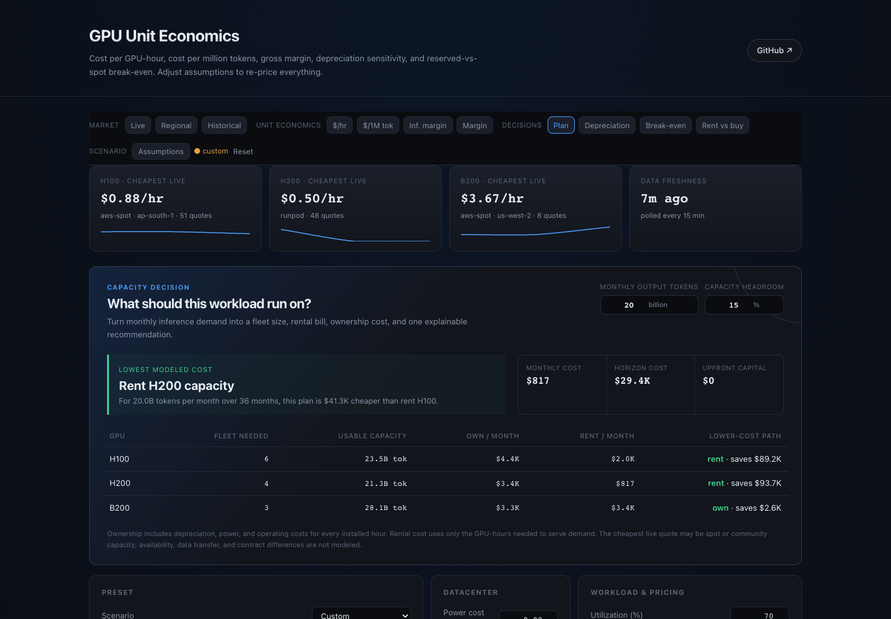
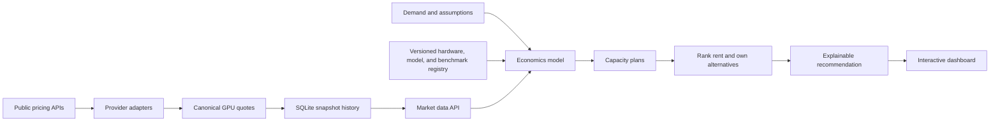

<p align="center">
  <h1 align="center">GPU Unit Economics</h1>
  <p align="center">
    <strong>A decision engine for GPU capacity, pricing, and profitability.</strong><br>
    Size an inference fleet, compare renting with owning, and trace every recommendation back to its assumptions.
  </p>
</p>

<p align="center">
  <a href="https://github.com/wolfiesch/gpu-unit-economics/actions/workflows/ci.yml"></a>
  
  
  <a href="LICENSE"></a>
</p>

GPU Unit Economics combines live rental quotes, published throughput benchmarks, historical hardware prices, and an explicit financial model. Give it a monthly token target and it recommends a GPU and a rent-or-own path—then shows the fleet size, monthly cost, capital requirement, and next-best alternative behind that answer.

<p align="center">
  
</p>

## Run it locally

```bash
uv sync --extra web --extra dev
uv run uvicorn web.app:app --reload
```

Open [http://127.0.0.1:8000](http://127.0.0.1:8000). The first live-price request may take several seconds while public provider endpoints respond.

The calculation core also works as a CLI with no web dependencies:

```bash
uv run gpu-econ
```

## What the product answers

| Decision | Output |
|---|---|
| **How much capacity do I need?** | GPU count required for monthly token demand, utilization, and reliability headroom |
| **Should I rent or own?** | Lowest modeled cost over the selected horizon, plus savings against the next-best choice |
| **Which GPU fits this inference workload?** | Memory fit and evidence-backed throughput across NVIDIA and AMD accelerators; ownership economics remain limited to GPUs with usable capex inputs |
| **Can the workload be profitable?** | Gross margin, annual profit per GPU, and a utilization-by-price heatmap |
| **Where is capacity cheapest?** | Live provider quotes, regional maps, and price-spread history |
| **How sensitive is the answer?** | Useful-life, utilization, power-price, and reserved-price comparisons |

## How the pieces connect



The browser never calls cloud vendors directly. The FastAPI backend collects and normalizes quotes, stores successful snapshots, and continues serving the last known batch when an upstream provider fails. Financial calculations live in the separate `gpu_econ` package so the CLI, API, and tests all use the same formulas. Interactive analysis uses Apache ECharts; the regional price map remains on Leaflet.

The included production timer runs the collector separately from web traffic every 15 minutes. Each run records provider-level success or failure, quote counts, and the exact snapshot lineage used by workload evaluations, historical backtests, and in-app decision triggers.

## Live and researched data

| Data | Sources | Reliability behavior |
|---|---|---|
| **GPU rental prices** | Vast.ai, RunPod, AWS, Azure, ComputePrices, Lambda, Hyperstack, SF Compute | 15-minute fetch-through cache; one provider failure does not discard other quotes |
| **Regional pricing** | Provider region labels and marketplace geography | Normalized coordinates with an explicit warning that regions are not perfect substitutes |
| **Inference throughput** | MLPerf, NVIDIA, AMD, and clearly labeled estimates | Every row keeps its engine, precision, test shape, source, confidence, and low/high range |
| **Token pricing** | OpenRouter public model catalog | Daily cache; used for implied inference-margin comparisons |
| **Electricity pricing** | US EIA industrial rates | Optional API key; monthly data cached for one day |
| **Historical GPU prices** | Audited source CSVs and FRED CPIAUCSL | Rejected rows and source-quality notes remain in the repository |

Provider responses use an explicit alias registry covering A100 80GB, L40S, H100, H200, MI300X, MI325X, and B200. Every live response reports when it was fetched, whether it is stale, and which providers failed.

### Benchmark evidence policy

The dashboard does not treat every performance number as equally trustworthy:

| Label | Meaning |
|---|---|
| **Measured** | A result traced to a published independent benchmark submission |
| **Vendor-reported** | A vendor published the result and test setup, but an independent benchmark body did not verify it |
| **Estimated** | The project derived a range from a nearby result; the derivation and low/high bounds are visible |
| **Unavailable** | No defensible apples-to-apples result was found; the product shows the gap instead of inventing a number |

The plain CSV registry under `data/registry/` is the source of truth. It includes eight hardware entries, NVIDIA and AMD coverage, five model definitions across Llama, Qwen, and DeepSeek, and source records that can be audited without running the app. The current registry contains 16 hardware/model records: six independently measured, five vendor-reported, and five estimated. Rack systems such as GB200 NVL72 remain systems; they are not silently converted into fictional single-GPU purchase prices.

## Decision model

For each GPU, the capacity planner follows four explicit steps:

1. Calculate usable monthly tokens from throughput, utilization, and reserved headroom.
2. Round the owned fleet up to the first whole GPU that can satisfy demand.
3. Price ownership for every installed hour using depreciation, power, and operating cost.
4. Price rental only for the active GPU-hours needed, then rank both choices across every GPU.

The underlying hourly model is:

```text
depreciation/hr = capex × (1 - residual value) ÷ useful life ÷ 8,760
power/hr        = board power × PUE × electricity price
opex/hr         = capex × annual opex rate ÷ 8,760
provisioned/hr  = depreciation/hr + power/hr + opex/hr
billable/hr     = provisioned/hr ÷ utilization
```

This keeps provisioned hours and billable hours separate. An owned GPU costs money while idle; rented capacity is charged only while used.

## API surface

| Endpoint | Purpose |
|---|---|
| `POST /compute` | Calculate unit economics, fleet plans, and the overall recommendation |
| `GET /api/prices` | Return the latest normalized live quotes and freshness metadata |
| `GET /api/prices/history` | Return trailing provider-price history for one GPU |
| `GET /api/prices/regions` | Group the newest quotes by region and calculate price spreads |
| `GET /api/prices/historical` | Return the audited 2016–2025 hardware-price dataset |
| `GET /api/benchmarks` | Return cited inference-throughput assumptions |
| `GET /api/registry` | Return versioned hardware, model, source, and confidence definitions |
| `GET /api/workloads` | Return workload profiles and registered models |
| `GET /api/token-prices` | Return cached open-model token prices |
| `GET /api/data-health` | Show the latest scheduled collection and provider outcomes |
| `POST /api/workloads/evaluate` | Check workload memory, latency, and throughput compatibility |
| `POST /api/backtests` | Replay a historical fixed decision with explicit data coverage |
| `GET/POST /api/alerts` | Manage persistent price and recommendation triggers |
| `GET /api/alerts/delivery-capabilities` | Report configured in-app, email, and webhook delivery channels |

## Alert delivery

Alert events are committed to SQLite before delivery begins. Email and webhook attempts use a durable queue with a processing lease, bounded exponential retries, and delivered or exhausted terminal states. A separate one-minute VPS timer drains the queue, so a notification outage never rolls back the underlying market snapshot or alert event.

Email uses SMTP and becomes available when the production container receives `SMTP_HOST` and `SMTP_FROM`. Optional variables are `SMTP_PORT`, `SMTP_USERNAME`, `SMTP_PASSWORD`, `SMTP_USE_TLS`, and `SMTP_USE_SSL`; see `deploy/gpu-econ.env.example`.

Webhook destinations must use HTTPS and resolve only to public IP addresses. Redirects are rejected. Every request includes:

| Header | Purpose |
|---|---|
| `X-GPU-Econ-Event` | Stable event identifier for receiver-side deduplication |
| `X-GPU-Econ-Timestamp` | Unix timestamp used in the signature input |
| `X-GPU-Econ-Signature` | `sha256=` HMAC of `<timestamp>.<raw request body>` |

The webhook signing secret is generated server-side and displayed only in the alert-creation response.

Creating an external delivery requires the `X-Alert-Token` header to match the server's `ALERT_DELIVERY_TOKEN`. The dashboard stores this operator token only in browser session storage and never places it in a URL or alert record.

## Quality and failure handling

```bash
uv run pytest -q       # 176 tests
uv run ruff check .    # Python linting
docker build -t gpu-unit-economics .
python -m web.collect_prices  # one scheduled collection run, then exit
```

The test suite covers hand-computed financial formulas, fleet sizing, every provider parser, SQLite retention and migration behavior, input validation, conditional HTTP requests, cache freshness, and stale-data fallback. GitHub Actions runs linting, tests, and a container build on every pull request.

## Project layout

```text
src/gpu_econ/          calculation core and CLI
web/app.py             FastAPI routes and request contracts
web/providers/         provider-specific normalization adapters
web/store.py           SQLite history, caching, and retention
web/static/            dashboard HTML, CSS, and JavaScript
data/registry/         versioned hardware, model, benchmark, and source CSVs
data/                  historical prices, sources, rejects, and audit notes
tests/                 formula, provider, storage, and API-level tests
```

## Assumptions and limitations

Default capex, utilization, and useful-life figures remain illustrative—not vendor quotes or investment advice. Hardware specifications and benchmark sources are cited separately. Token throughput varies materially by model, engine version, quantization, batch size, context length, and latency target. Regional prices are not automatically interchangeable because latency, data residency, availability, and contract terms differ.

The application is designed to make those assumptions easy to replace and hard to hide.

## License

[MIT](LICENSE)
