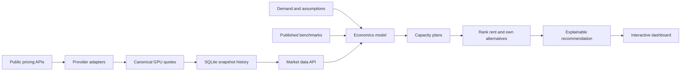

<p align="center">
  <h1 align="center">GPU Unit Economics</h1>
  <p align="center">
    <strong>A decision engine for GPU capacity, pricing, and profitability.</strong><br>
    Size an inference fleet, compare renting with owning, and trace every recommendation back to its assumptions.
  </p>
</p>

<p align="center">
  <a href="https://github.com/wolfiesch/gpu-unit-economics/actions/workflows/ci.yml"></a>
  
  
  <a href="LICENSE"></a>
</p>

GPU Unit Economics combines live rental quotes, published throughput benchmarks, historical hardware prices, and an explicit financial model. Give it a monthly token target and it recommends a GPU and a rent-or-own path—then shows the fleet size, monthly cost, capital requirement, and next-best alternative behind that answer.

<p align="center">
  
</p>

## Run it locally

```bash
uv sync --extra web --extra dev
uv run uvicorn web.app:app --reload
```

Open [http://127.0.0.1:8000](http://127.0.0.1:8000). The first live-price request may take several seconds while public provider endpoints respond.

The calculation core also works as a CLI with no web dependencies:

```bash
uv run gpu-econ
```

## What the product answers

| Decision | Output |
|---|---|
| **How much capacity do I need?** | GPU count required for monthly token demand, utilization, and reliability headroom |
| **Should I rent or own?** | Lowest modeled cost over the selected horizon, plus savings against the next-best choice |
| **Which GPU is cheapest for inference?** | Effective tokens per hour and cost per million tokens across H100, H200, and B200 |
| **Can the workload be profitable?** | Gross margin, annual profit per GPU, and a utilization-by-price heatmap |
| **Where is capacity cheapest?** | Live provider quotes, regional maps, and price-spread history |
| **How sensitive is the answer?** | Useful-life, utilization, power-price, and reserved-price comparisons |

## How the pieces connect



The browser never calls cloud vendors directly. The FastAPI backend collects and normalizes quotes, stores successful snapshots, and continues serving the last known batch when an upstream provider fails. Financial calculations live in the separate `gpu_econ` package so the CLI, API, and tests all use the same formulas. Interactive analysis uses Apache ECharts; the regional price map remains on Leaflet.

## Live and researched data

| Data | Sources | Reliability behavior |
|---|---|---|
| **GPU rental prices** | Vast.ai, RunPod, AWS, Azure, ComputePrices, Lambda, Hyperstack, SF Compute | 15-minute fetch-through cache; one provider failure does not discard other quotes |
| **Regional pricing** | Provider region labels and marketplace geography | Normalized coordinates with an explicit warning that regions are not perfect substitutes |
| **Inference throughput** | Published MLPerf results and documented estimates | Workload-specific presets keep throughput assumptions visible |
| **Token pricing** | OpenRouter public model catalog | Daily cache; used for implied inference-margin comparisons |
| **Electricity pricing** | US EIA industrial rates | Optional API key; monthly data cached for one day |
| **Historical GPU prices** | Audited source CSVs and FRED CPIAUCSL | Rejected rows and source-quality notes remain in the repository |

Provider responses are normalized to canonical `H100`, `H200`, and `B200` names. Every live response reports when it was fetched, whether it is stale, and which providers failed.

## Decision model

For each GPU, the capacity planner follows four explicit steps:

1. Calculate usable monthly tokens from throughput, utilization, and reserved headroom.
2. Round the owned fleet up to the first whole GPU that can satisfy demand.
3. Price ownership for every installed hour using depreciation, power, and operating cost.
4. Price rental only for the active GPU-hours needed, then rank both choices across every GPU.

The underlying hourly model is:

```text
depreciation/hr = capex × (1 - residual value) ÷ useful life ÷ 8,760
power/hr        = board power × PUE × electricity price
opex/hr         = capex × annual opex rate ÷ 8,760
provisioned/hr  = depreciation/hr + power/hr + opex/hr
billable/hr     = provisioned/hr ÷ utilization
```

This keeps provisioned hours and billable hours separate. An owned GPU costs money while idle; rented capacity is charged only while used.

## API surface

| Endpoint | Purpose |
|---|---|
| `POST /compute` | Calculate unit economics, fleet plans, and the overall recommendation |
| `GET /api/prices` | Return the latest normalized live quotes and freshness metadata |
| `GET /api/prices/history` | Return trailing provider-price history for one GPU |
| `GET /api/prices/regions` | Group the newest quotes by region and calculate price spreads |
| `GET /api/prices/historical` | Return the audited 2016–2025 hardware-price dataset |
| `GET /api/benchmarks` | Return cited inference-throughput assumptions |
| `GET /api/token-prices` | Return cached open-model token prices |

## Quality and failure handling

```bash
uv run pytest -q       # 121 tests
uv run ruff check .    # Python linting
docker build -t gpu-unit-economics .
```

The test suite covers hand-computed financial formulas, fleet sizing, every provider parser, SQLite retention and migration behavior, input validation, conditional HTTP requests, cache freshness, and stale-data fallback. GitHub Actions runs linting, tests, and a container build on every pull request.

## Project layout

```text
src/gpu_econ/          calculation core and CLI
web/app.py             FastAPI routes and request contracts
web/providers/         provider-specific normalization adapters
web/store.py           SQLite history, caching, and retention
web/static/            dashboard HTML, CSS, and JavaScript
data/                  historical prices, sources, rejects, and audit notes
tests/                 formula, provider, storage, and API-level tests
```

## Assumptions and limitations

Default capex, throughput, utilization, power, and useful-life figures are illustrative—not vendor quotes or investment advice. Token throughput varies materially by model, quantization, batch size, context length, and latency target. Regional prices are not automatically interchangeable because latency, data residency, availability, and contract terms differ.

The application is designed to make those assumptions easy to replace and hard to hide.

## License

[MIT](LICENSE)
